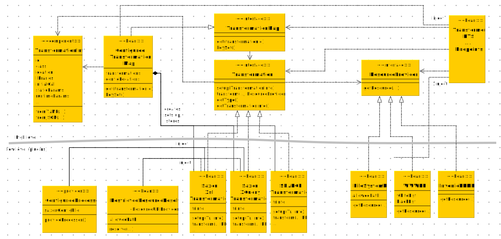

# Architecture

## Dependency Inversion

SEED XC follows the dependency inversion principle (DIP) and thus has
a clean architectural boundary between high level and low level
components. (Cf. Martin 2018, pp.87)

There are two very fundamental types, `ResourceProvider` and
`Transformation`. The first allows us to get a resource from some kind
of storage or persistence location, while the latter is some process
that takes the resource as input and returns some kind of transformed
output.  These two types are abstract and defined as interfaces. They
don't know about the file system, a database or the web as storage for
resources and they don't know about XSLT, XQuery, etc. as
transformations. Handling such things is implementation details, which
may be realized in a plugin: There is a `FileSystemResourceProvider`
for allowing access to parts of the local file system or a
`WWWResourceProvider` with white and blacklisted URL patterns, or
plugins that provide access to an RDBMS or to Invenio RDM; there may
be transformations for processing with XSLT, XQuery or SPARQL. None of
the components above the gray architectural boundary depends on such
details, but the plugins depend on the high-level types as they
implement them. That's dependency inversion. It allows, to add plugins
for new types of transformations or new resource providers for
persistence layers, while not re-compiling the high level components.

## High Level

### Startup

At service startup, the `ConfiguredTransformationMap` is eagerly
created. It is an application-scoped bean, i.e., its lifetime spans
the whole uptime of the service and there's only one instance.

The `ConfiguredTransformationMap` sets up all transformations
available on the service at startup, and makes them available for
requests. For transformations based on compiled languages such as XSLT
and XQuery, this means, that compilation is done only once and the
compiled transformation is used for all requests coming in during the
uptime of the service. Observation of the server logs show, that 4/5
of the time for compiling the stylesheet, when processing a short XML
file with a complicated stylesheet. Thus, this compile-once
architecture turns out to perform very well.

The `ConfiguredTransformationMap` has a `configLocation` attribute,
which which is a configurable path to a [YAML configuration
file](configuration.md) defining all transformations available on the
service. The configuration is an key-value map, mapping transformation
IDs to `TransformationInfo` records. So there will be one
`Transformation` instance per `TransformationInfo` record given in the
service configuration. And each `Transformation` instance is stored in
a key-value store of the `ConfiguredTransformationMap` bean and
accessible per ID.

A `TransformationInfo` has information, which transformation plugin to
use for the `Transformation` instance. The record also knows which
primary resource to use (e.g. a XSLT stylesheet) and which other
library resources (e.g. XSLT packages) it depends on. It also defines
which compile-time parameters to set during the setup
phase. You can compile the same XSLT stylesheet with different
compile-time parameters and make different transformations out of it;
each would require its own `TransformationInfo` record.

There's a [XSLT stylesheet](configuration.md#generation-from-xslt) for
generating YAML records for a given XSLT stylesheet or package.

There's no way to pass in additional transformations during the uptime
of the service. The set of available transformations is determined at
start time and the transformation resources (stylesheets etc.) can be
read from the file system (configMap on Kubernetes) only. That's a
feature: A [security](../security) feature as well as an operational
feature: It results in a service that scales horizontally.

After successful startup, the `ConfiguredTransformationMap` bean lives
for ever and provides access to the transformations via its public
methods.

### Request Processing

When a request comes in at a REST API endpoint (north-east in
diagram), the underlying framework (Quarkus and its bean manager)
creates an endpoint bean which knows how to process the
request. Typically, it is request-scoped, i.e., its lifecycle starts
with the incoming request and ends when it was successfully processed
or interrupted with a failure. Each endpoint has it's own bean
class; but the diagram shows only one prototype. The endpoint bean
gets two other beans injected:

1. a `ResourceProvider`. Which implementation is actually used is
   defined by an application property. The bean may be request- or
   application-scoped.
2. a `TransformationMap`, actually the `ConfiguredTransformationMap`
   with access to all the compiled transformations available on the
   service

Processing the request by the endpoint bean typically involves the
following steps:

1. get the resource to be processed by calling the `getRequest(...)`
   method of the injected resource provider as a input stream
2. get the requested (or configured) `Transformation` by
   transformation ID from the injected transformation map and pass the
   input stream over to its transform method (`transform(...)` or
   `transformAsync(...)`)
3. send the byte stream returned by the transform method back to the
   wire

Getting an input stream in step 1 and passing it over to the transform
method of step 2 here means that the high-level components are format
agnostic. The machinery can process XML, RDF-serializations, etc., as
long as there are low level transformation plugins that process
them.

Depending on the specifics of the endpoint's REST API, uploading a
document can also be done, in which case the resource provider has to
do nothing in step 1.

The transform method also takes the resource provider from step 1 as
an argument, so the transformation plugin that drives the
transformation can use it for subsequent requests, e.g, when
processing an XInclude element in an XML document. The endpoint also
passes request parameters to `transform(...)`. There are a number of
classes for such arguments to the transform method, which are not
represented in the diagram, e.g. `RuntimeParameters` for passing
runtime parameters to an XSLT stylesheet, or `Config` for selecting a
DOM parser (HTML tagsoup instead of well-formed XML). Details depend
on the specifics of the endpoint and on the implementation of the
transformation plugin or the configuration parameters of the actual
transformation.

## Low Level

### Resource Providers

### Transformations

